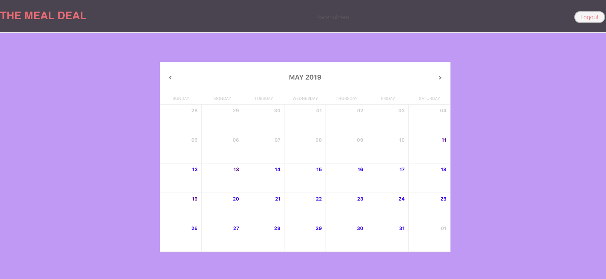
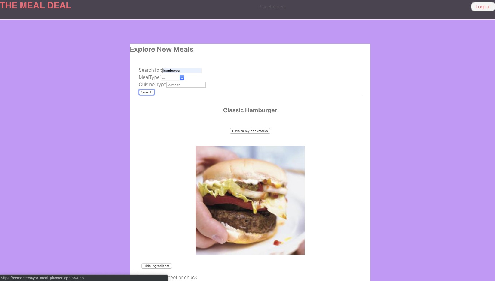
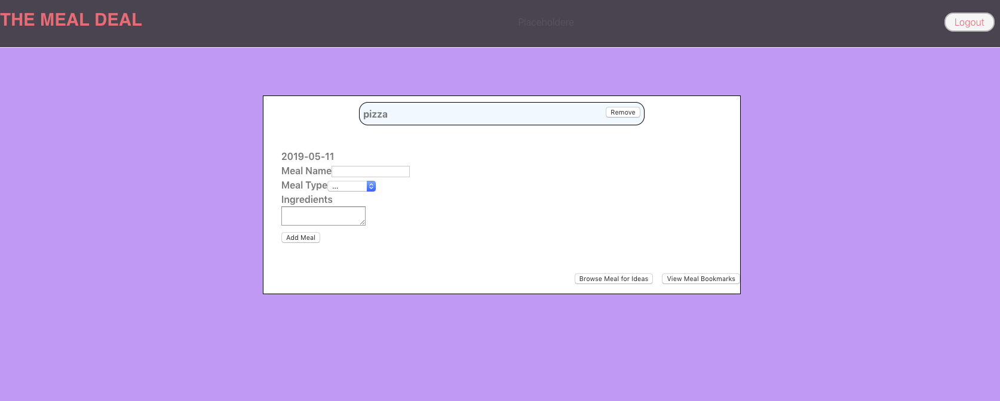

## THE MEAL DEAL

### link 
    https://eemontemayor-meal-planner-app.now.sh/

### API documentation
    
    GET /meals    
    GET /meals/:date

    POST /meals
    POST /meals/:date

    DELETE /meals/:date

### screenshots

     

     

     

### summary
    This is a meal planner app.
    The user can browse/search for meals on the 'edamam' website 
        and bookmark those meals for later.
    The user can open up their calendar and click on a day.
    After clicking on a day, the user can either add their own 
        meals to that day or browse meals from 'edamam' and add the
             meal to that particular day.

### future improvements
User will be able to view their meal history when adding a meal.
User will be able to see their meals of the day when hovering over a calendar day.

### technologies
    This app utilizes HTML, CSS, React, Node, Express, and PostgreSQL
